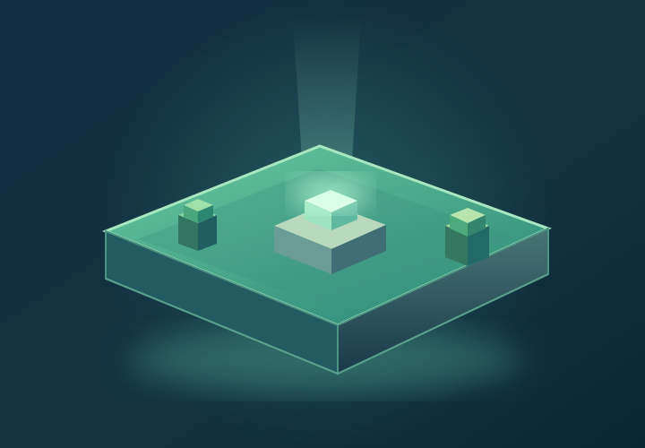

  <section class="home-hero" aria-labelledby="home-title">
    

      ERRSA · MINECRAFT STAFF
      <h1 id="home-title">Welcome to your staff wiki.</h1>
      
One place to learn the server, find the right procedure, and get back to helping players.

      Choose where you want to start ↓
    

    
  </section>
  <section class="home-destinations" aria-label="Explore the wiki">
    <a class="home-destination" href="documentation/">
      <svg focusable="false" xmlns="http://www.w3.org/2000/svg" viewBox="0 0 24 24"><path d="m19 2-5 4.5v11l5-4.5zM6.5 5C4.55 5 2.45 5.4 1 6.5v14.66c0 .25.25.5.5.5.1 0 .15-.07.25-.07 1.35-.65 3.3-1.09 4.75-1.09 1.95 0 4.05.4 5.5 1.5 1.35-.85 3.8-1.5 5.5-1.5 1.65 0 3.35.31 4.75 1.06.1.05.15.03.25.03.25 0 .5-.25.5-.5V6.5c-.6-.45-1.25-.75-2-1V19c-1.1-.35-2.3-.5-3.5-.5-1.7 0-4.15.65-5.5 1.5V6.5C10.55 5.4 8.45 5 6.5 5"/></svg>
      <strong>Documentation</strong>Server information, policies, procedures, and more.
      ↗
    </a>
    <a class="home-destination" href="learning/">
      <svg focusable="false" xmlns="http://www.w3.org/2000/svg" viewBox="0 0 24 24"><path d="M12 3 1 9l11 6 9-4.91V17h2V9M5 13.18v4L12 21l7-3.82v-4L12 17z"/></svg>
      <strong>Learning</strong>Follow a clear path through staff training.
      ↗
    </a>
    <a class="home-destination" href="tools/">
      <svg focusable="false" xmlns="http://www.w3.org/2000/svg" viewBox="0 0 24 24"><path d="m22.7 19-9.1-9.1c.9-2.3.4-5-1.5-6.9-2-2-5-2.4-7.4-1.3L9 6 6 9 1.6 4.7C.4 7.1.9 10.1 2.9 12.1c1.9 1.9 4.6 2.4 6.9 1.5l9.1 9.1c.4.4 1 .4 1.4 0l2.3-2.3c.5-.4.5-1.1.1-1.4"/></svg>
      <strong>Tools</strong>Reference external services the server uses.
      ↗
    </a>
    <a class="home-destination" href="troubleshooting/">
      <svg focusable="false" xmlns="http://www.w3.org/2000/svg" viewBox="0 0 24 24"><path d="M14 12h-4v-2h4m0 6h-4v-2h4m6-6h-2.81a6 6 0 0 0-1.82-1.96L17 4.41 15.59 3l-2.17 2.17a6 6 0 0 0-2.83 0L8.41 3 7 4.41l1.62 1.63C7.88 6.55 7.26 7.22 6.81 8H4v2h2.09c-.05.33-.09.66-.09 1v1H4v2h2v1c0 .34.04.67.09 1H4v2h2.81c1.04 1.79 2.97 3 5.19 3s4.15-1.21 5.19-3H20v-2h-2.09c.05-.33.09-.66.09-1v-1h2v-2h-2v-1c0-.34-.04-.67-.09-1H20z"/></svg>
      <strong>Troubleshooting</strong>Start with the problem and find a solution.
      ↗
    </a>
  </section>

