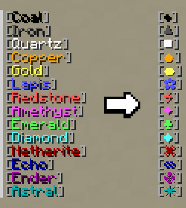

---
tags:
- MOD
- ADMIN
- DEV
- SERVER LEAD
---

# Module 1 · Understanding ERRSA MC

This module provides a high-level understanding of how ERRSA MC is structured, why it exists, and the major systems that make up the server.

---

## Server Details

ERRSA MC is a Minecraft server network built around a vanilla-focused survival experience for Embry-Riddle students.

!!! info "Server architecture"
    ERRSA MC currently runs **Minecraft Java Edition 1.21.4** using [Paper]("Paper is a high-performance server software for Minecraft") servers connected through a [proxy]("A Minecraft proxy is a server that acts as a middleman between players and the actual paper servers, allowing you to link multiple servers together under one network") running on [Velocity]("Velocity is a high-performance proxy server software for Minecraft").
    
    The server also utilizes the [plugins]("A plugin is a server-side extension that adds or changes the games functionality without requiring players to install a separate mod on their own computer") known as [Geyser](../../plugins/server-and-infrastructure/geyser-spigot.md){ data-preview } and [Floodgate](../../plugins/server-and-infrastructure/floodgate.md){ data-preview } to allow Bedrock Edition players to connect.

The network consists of:

- One proxy server running on Velocity software.
- Three servers running on Paper software:
    - **Main** — The primary server on the network that hosts both the survival and creative worlds.
    - **Events** — An additional server that is used for temporary events and activities.
    - **Backup** — Another server used for development, testing, and troubleshooting.

The proxy allows multiple Minecraft servers to operate behind the same public server address and lets players move between them while in-game.

---

## Server Purpose

ERRSA MC was created as another way for ERRSA to engage with a wider range of students and further its mission of building a bigger, better community on campus.

Not every student enjoys loud, crowded social events. ERRSA MC provides an alternative way for students to interact, socialize, and build meaningful relationships through a shared online environment.

!!! quote "The main takeaway"
    The goal of ERRSA MC has been, and always will be, to **build community**.

---

## Survival, Economy & Claiming Philosophy

ERRSA MC is intentionally **vanilla-focused**. The goal is to provide an experience that feels familiar and accessible without requiring complicated modpacks or extensive prior knowledge.

At the same time, the server uses plugins to provide systems that are difficult to achieve through vanilla Minecraft alone.

These systems allow ERRSA MC to provide functions such as:

- Land claiming to protect player builds.
- An economy and shops for easy player-to-player trading.
- Moderator tools for ensuring rule enforcement and fairness.
- Additional systems that support collaboration and community building.

The goal is to preserve the accessibility of vanilla Minecraft while providing the tools necessary to maintain a safe, fair, and friendly community.

---

## Major Server Features

In addition to the core survival, claiming, economy, and shop systems, ERRSA MC includes several systems designed to encourage community participation.

These include:

- Guilds for player groups and collaboration.
- Quests for additional goals and activities.
- Play time ranks and rewards.
- Creative mode on the plots world for building.
- Community events.
- Custom server resources and cosmetics.

These features all support the same larger goal: **building community**.

---

## Worlds & Servers

ERRSA MC contains several separate environments, each serving a different purpose.

| Server | World        | Purpose                                                                                                      |
|--------|--------------|--------------------------------------------------------------------------------------------------------------|
| Main   | Survival     | The primary environment where players spend most of their time.                                              |
| Main   | Creative     | A creative environment where players can claim plots and build without the limitations of survival.          |
| Main   | Legacy Lake  | A special world that serves as a tribute to previous ERRSA Executive Board members.                          |
| Events | (All worlds) | A separate server for hosting events without affecting player inventories, data, or the main survival world. |
| Backup | (All worlds) | Used to test new features, plugins, configuration changes, and bug fixes before they affect the main server. |

---

## How Players Interact With the Network

When players join ERRSA MC, they connect using the network's **proxy IP address**. The proxy acts as the entry point to the network and automatically forwards players to the Main server on the survival world by default.

Most players primarily interact with the Main server on the survival world, but the other environments are available when appropriate.

Players can use the server browser to move between available servers and worlds without disconnecting from the network.

!!! tip "Think of the network as one community"
    Players see ERRSA MC as one community, even though the network is made up of multiple Minecraft servers behind the scenes.

---

## LuckPerms Tracks & Roles

ERRSA MC uses [LuckPerms](../../plugins/permissions-and-moderation/luckperms.md){ data-preview } to manage permissions and player rank tags.

A track is a sequential set of ranks that represents progression within a specific category.

ERRSA MC currently uses four major tracks:

=== "Main Track"

    The Main track controls a player's basic server permissions.

    - **Default** — Automatically assigned when a player joins the server for the first time, and is removed once a player successful completes the registration process. It intentionally has very limited permissions and prevents the player from entering the survival, or other worlds
    - **User** — Assigned after successful email registration and provides common player permissions such as `/tpa`, `/warp`, and `/spawn`. See also the "Non-Track Roles" tab for more info related to the user role.
    - **VIP** — Intended for players who purchase VIP. It provides cosmetic and quality-of-life permissions such as `/hat`

    !!! warning "VIP status"
        The VIP system is currently a work in progress and is not yet available for purchase.

=== "Rank Progression Track"

    The Rank Progression track rewards players for reaching playtime milestones.

    

    Players can view available ranks and rewards through `/progression`.

    There is a also special hidden rank, called "Zenith" which is automatically given to the player with the most playtime on the server.

    !!! info "Rank progression reference"
        See the [Rank Progression plugin documentation](../../plugins/gameplay-and-progression/rank-progression.md) for the current ranks, permissions, and rewards.

=== "ERRSA Track"

    The ERRSA track represents a player's relationship to ERRSA rather than their Minecraft staff role.

    It includes:

    - **ERRSA** — General ERRSA-related membership
    - **Hall Rep** — ERRSA Hall Representatives
    - **Legacy** — Previous Executive Board members
    - **Exec Coord** — Executive Coordinators and ERAU staff who directly support ERRSA
    - **Exec Board** — Current ERRSA Executive Board members
    - **Advisor** — The current ERRSA advisor or professional staff

    These ranks do not generally grant additional permissions. **Exec Coord and higher inherit VIP permissions.**

=== "Staff Track"

    The Staff track contains the four Minecraft staff roles:

    - Moderator
    - Admin
    - Developer
    - Server Lead

    Staff ranks represent responsibilities and access within the Minecraft server rather than player progression.

    Each of these staff ranks will be explained further throughout these learning modules, or can be reference in [Section 2.3](../../documentation/staff-roles-responsibilities.md#23-staff-roles){ data-preview } of the staff documentation.

=== "Non-Track Roles"

    Some roles are not part of a specific track and instead provide permissions based on a player's world, server, or assigned responsibilities. Unlike tracks, these roles do not represent a sequential rank progression.

    In LuckPerms, **contexts** determine when a group's permissions apply. Contexts can specify conditions such as a particular world, server, dimension, or game mode, allowing permissions to be applied only when the player's current environment matches the specified conditions.

    ### Survival

    The Survival role grants permissions for survival gameplay, including shops, selling, economy features, and other survival-related functions.

    - **Inheritance:** Inherited by the User role.
    - **Context:** Applies to the main survival world: `world`, the Nether: `world_nether`, and the End: `world_the_end`.

    ### Creative

    The Creative role grants permissions for the creative environment, including plot commands and WorldEdit.

    - **Inheritance:** Inherited by the User role.
    - **Context:** Applies only to the plots world: `plotworld`.

    ### Events

    The Events role grants permissions needed to participate in the current custom event. Its permissions can be customized for individual events based on their requirements.

    - **Inheritance:** Inherited by the User role.
    - **Context:** Applies on the Events server.

    ### Helper

    The Helper role provides temporary permissions needed for specific projects or tasks. Its permissions are customized according to the requirements of the work being performed.

    - **Inheritance:** Not inherited by the User role. Granted directly to specific players on an as-needed basis.
    - **Context:** Configured for the relevant world or server.

    ### Premium Permissions

    Premium Permissions contains the permissions associated with VIP perks.
    
    - **Inheritance:** Selectively inherited by the VIP role, eligible ERRSA ranks, and staff roles.
    - **Purpose:** Separates VIP perks from the VIP rank itself, allowing perks to be granted independently of VIP status.
    
    !!! info "Why are VIP perks stored separately?"
        Premium Permissions is kept separate from the VIP role so that eligible ERRSA members and staff can receive VIP perks without automatically inheriting the VIP chat prefix. This prefix is reserved exclusively for players who have purchased VIP directly.

---

<nav class="handbook-next" aria-label="Continue reading">
  <a href="../mod2/">
    <small>Next section</small><strong>Module 2 · Server Rules & Expectations</strong>Learn the server's rules, staff expectations, and enforcement policy.
    →
  </a>
</nav>
